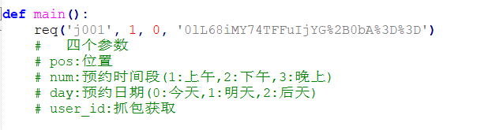
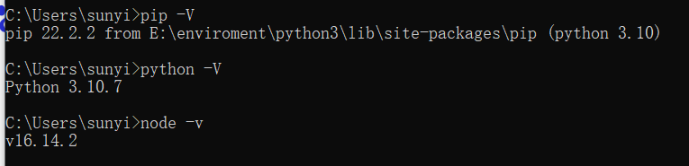
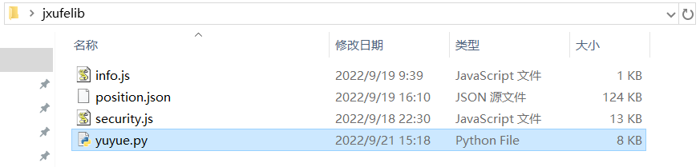
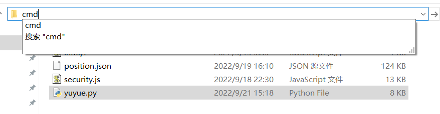

解压后找到yuyue.py文件，打开

找到main函数，按照提示更改所需的参数



其中user_id通过抓包获取

然后安装和配置系统环境 python 和 node.js(自己百度)

通过以下几个命令判断时候安装成功

```
python -V
pip -V
node -v
```



接下来安装所需的依赖包，输入如下命令

```
pip install requests
pip install PyExecJS
```

最后到解压目录下



在路径栏中输入cmd，点击回车



在命令行中输入如下命令

```
python yuyue.py
```


返回信息的格式为：

请求发送时间(2022-09-21 15:34:12)	预约的位置(j001)	预约的时间段(上午)	预约的日期(2022-09-21)	反馈
